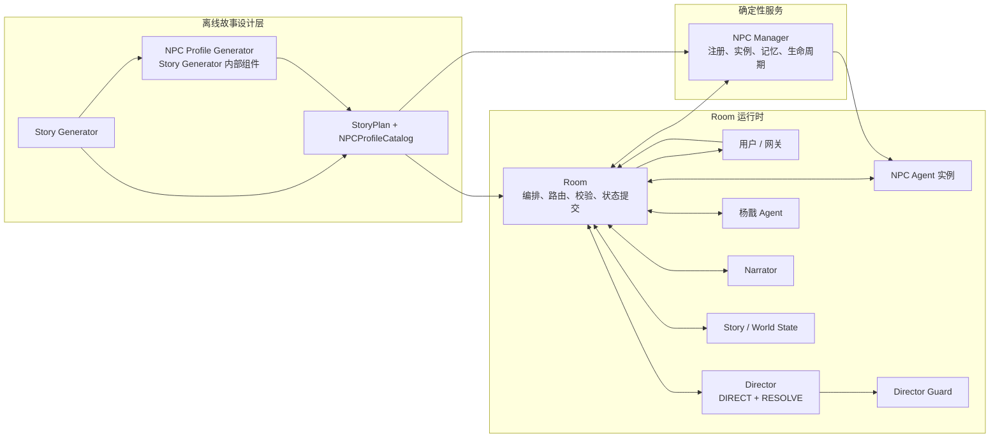

# 杨戬交互体验模拟器

**项目名：** 杨戬故事模拟器  
**核心模式：** 多 Agent 演员 · 导演两阶段裁决 · 状态机故事  
**通信层：** Hermes Agent → Photon (iMessage) 直达小仙汉

本项目是一个由 Room 统一编排的多 Agent 互动故事运行时。当前版本采用：

- 统一的 `AgentMessage[Payload]` 消息外壳；
- Director 的 `DIRECT → ACT → RESOLVE → NARRATE` 流程；
- 杨戬与 NPC Agent 共用 Actor 结果契约；
- Narrator 独立于角色对象池，只在 RESOLVE 后运行；
- NPC Agent 与 NPC Manager 完全分离；
- Story Generator 在离线生成故事时同时生成完整 NPC Profile；
- Room 是唯一能够发布消息、提交世界状态和推进 Beat 的组件。

## 1. 一句话架构

**Room** 是确定性编排者与状态提交者。**Director（导演 Agent）** 分两阶段裁决：DIRECT 阶段分配任务与 NPC 命令，RESOLVE 阶段裁决角色行动。Room 按裁决依次调用 Actor、应用 NPC Manager 命令、收集 `ActorTurnResult`、形成 `ConfirmedEvent`，必要时再调用 Narrator 描述已确认的外部事实，最后发布消息并写入状态。小仙汉在 Room 中与受控的 Agent 演员交互，推动故事。

Director 不做 hold：即使所有角色都请求不行动，也必须通过重派任务、其他角色行动、授权世界事件或推进已解锁 Beat 保证系统继续运行。

## 2. 总体架构



### 三种不同对象

1. **行动 Agent**
   - 杨戬 Agent；
   - 当前已激活的 NPC Agent。
   - 它们共同组成 `Actor Pool`，接收 `AgentTask`，返回行动提议或不行动请求。

2. **展示 Agent**
   - Narrator。
   - 它不属于 `Actor Pool`，不接收角色任务，只在 RESOLVE 后描述 `ConfirmedEvent`。

3. **确定性服务**
   - Room、NPC Manager、Director Guard、状态机、Story Runtime。
   - 它们不是角色，不生成角色对白。

## 3. 一次完整交互流程

```
用户说："我去院子里找哮天犬。"
        │
        ▼
┌─────────────────────────────────────────────────────────────┐
│  Room 收到消息（photon_room_bridge → room.tick）               │
│  · 读取 world_state / story_state                            │
│  · 加载当前 Beat 与 NPC Profile 目录                         │
└──────────────────────┬──────────────────────────────────────┘
                       │ Phase DIRECT
                       ▼
┌─────────────────────────────────────────────────────────────┐
│  Director DIRECT                                             │
│  · 理解用户意图                                              │
│  · 输出 actor_tasks（杨戬、哮天犬等）                        │
│  · 输出 npc_commands（ensure_registered / activate）       │
│  · 可选 narration_request、fallback_world_event            │
│  → Guard 校验后返回 DirectorDirective                        │
└──────────────────────┬──────────────────────────────────────┘
                       │ Room 执行 npc_commands → NPC Manager
                       │ Phase ACT
                       ▼
  ┌──────────┐    ┌──────────┐
  │ 杨戬 Agent│    │NPC Agent │
  │         │    │(哮天犬)  │
  │返回提议  │    │返回提议   │
  │或弃权    │    │或弃权     │
  └──────────┘    └──────────┘
                       │ Phase RESOLVE
                       ▼
┌─────────────────────────────────────────────────────────────┐
│  Director RESOLVE                                            │
│  · 对每个 ActorTurnResult 裁决 accept / modify / reject      │
│  · 对 AbstainRequest 裁决 accept_abstention                  │
│  · 产生 ConfirmedEvent、状态操作、ContinuationPlan           │
└──────────────────────┬──────────────────────────────────────┘
                       │ Room 应用裁决，过滤 forbidden_reveals
                       │ Phase NARRATE（如 Director 请求）
                       ▼
┌─────────────────────────────────────────────────────────────┐
│  Narrator（可选）                                            │
│  · 只读 ConfirmedEvent，不写角色对白                         │
│  → 输出场景描写                                              │
└──────────────────────┬──────────────────────────────────────┘
                       ▼
┌─────────────────────────────────────────────────────────────┐
│  Room 发布最终消息，写入 public_room_history 与世界状态       │
│                                                              │
│  【哮天犬】它没有回头，但尾巴轻轻摇了摇                       │
│  【杨戬】他头也没抬："它在那儿站了一下午了。"                 │
│  【旁白】院子的地上落了一层槐花……（若本回合有旁白请求）       │
└─────────────────────────────────────────────────────────────┘
```

与旧版「织梦者一次裁决说话顺序」不同：角色对白由 Actor 在 ACT 阶段提议、Director 在 RESOLVE 阶段确认；Narrator 不参与 Actor Pool，只在裁决后描述已确认的外部事实。

## 4. 场景示例

**院子找哮天犬**

- DIRECT：分配杨戬与哮天犬任务，激活哮天犬 NPC；
- ACT：哮天犬返回动作提议，杨戬返回对白提议；
- RESOLVE：接受哮天犬尾巴摇动、杨戬简短回应；
- NARRATE（可选）：旁白补充槐花、安静氛围等可见环境。

**杨戬独自在院中（桃山旧事）**

用户："你昨晚是不是没睡好？"

- DIRECT：只给杨戬任务，不要求 NPC 出场；
- ACT：杨戬可返回对白或 AbstainRequest；
- RESOLVE：若接受「睡了。」过快回答，形成确认事件；
- NARRATE：旁白可描述眼底青色、冷茶等外部可见细节。

**天兵来巡（天庭来客）**

用户："外面好像有人。"

- DIRECT：`npc_commands` 激活天兵，`actor_tasks` 分配给天兵与杨戬；
- ACT：天兵提议压低声音的台词，杨戬提议翻书不语；
- RESOLVE：分别裁决后发布；
- 用户下一轮再介入，不由 Director 预设固定「说话顺序」。

## 5. Agent 和服务职责

### Room

Room 是系统唯一编排者和状态提交者：

| 职责 | 不负责 |
| --- | --- |
| 接收/分发用户消息 | ❌ 不做剧情决策 |
| 创建统一 `AgentMessage` Envelope | ❌ 不替 Agent 说话 |
| 调用 Director DIRECT / RESOLVE | ❌ 不决定角色对白内容 |
| 执行 `NPCCommand`、分发 `AgentTask` | ❌ 不绕过 Guard |
| 只发布已裁决的消息 | |
| 维护 `public_room_history`、世界与故事状态 | |
| 校验并推进已解锁 Beat | |

Agent 不得直接调用另一个 Agent，也不得直接修改状态。

### Director

Director 是调度者和裁决者，不是角色或旁白。

| 职责 | 不负责 |
| --- | --- |
| DIRECT：分配 `AgentTask`、`NPCCommand` | ❌ 不写旁白 |
| RESOLVE：裁决每个 `ActorTurnResult` | ❌ 不替角色发言 |
| 产生 `ContinuationPlan`（必填） | ❌ 不能 hold 或停止运行时 |
| 可选请求 `NarrationRequest` | ❌ 不透露全知视角给用户 |

DIRECT 阶段输出 `DirectorDirective`：`actor_tasks`、`npc_commands`、`narration_request`、`fallback_world_event` 等。

RESOLVE 阶段输出 `DirectorResolution`：对每个结果的 `ActorResultDecision`、状态操作、`ContinuationPlan`。

### 杨戬 Agent

杨戬接收：

- Director 分配的 `AgentTask`；
- 当前场景；
- Room 中近期全部公开消息（`public_room_history`）；
- 杨戬个人可感知事实；
- 个人记忆、关系和立场。

`public_room_history` 包含用户、杨戬、NPC 和旁白已经公开发布的消息，不再只保留「与杨戬有关」的用户消息。

杨戬只能返回 `ActorProposal` 或 `AbstainRequest`。SOUL 人设见项目内杨戬相关配置。

### NPC Agent

NPC Agent 是某个已注册 NPC Profile 的动态角色实例。

| 职责 | 不负责 |
| --- | --- |
| 读取 NPC Manager 构造的 `NPCTurnInput` | ❌ 不能创建或修改 Profile |
| 按 Profile、记忆、可见消息扮演角色 | ❌ 不能自行激活/停用/归档 |
| 返回 `ActorProposal` 或 `AbstainRequest` | ❌ 不能决定行动已成功 |

每个在场 NPC 是独立 Agent 实例，由 Director 通过 `actor_tasks` 分别调度。

### NPC Manager

NPC Manager 是确定性服务，不是 Agent。

它负责：

- 接收 Story Generator 生成的完整 NPC Profile；
- 按 `profile_id` 和版本注册 Profile；
- 创建或复用 NPC 实例；
- 执行 `ensure_registered / activate / deactivate / complete`；
- 管理 NPC 私有记忆和生命周期；
- 根据权限过滤事实；
- 构造 `NPCTurnInput`；
- 记录 Director 已接受的 NPC 事件。

NPC Manager 不再在 Room 回合中调用 LLM 临时生成人设。

### Narrator

Narrator 是独立的 Presentation Agent：

| 职责 | 不负责 |
| --- | --- |
| 根据 `NarrationRequest` 写场景描写 | ❌ 不做剧情走向判断 |
| 只读 RESOLVE 后的 `ConfirmedEvent` | ❌ 不写角色内心（除非公开可见） |
| 第三人称叙述 | ❌ 不替角色说话、行动或决策 |
| 输出经 Room 校验的 `NarrationDraft` | |

### Story Generator

Story Generator 在 Room 运行前工作，输出：

- `StoryPlan`；
- `NPCProfileCatalog`（每个 `NPCRequirement` 对应完整 `NPCProfileSpec`）；
- 校验版本。

NPC Profile Generator 是 Story Generator 的内部组件，不属于 Room 运行时 Agent。

旧 StoryPlan 如果没有 `npc_profiles`，`story_state.get_npc_profile()` 会进行确定性兼容转换；该兼容层不会调用运行时 LLM。建议使用新版 Story Generator 重新生成并保存旧计划。

## 6. 统一消息 Envelope

所有运行时 Agent 入口都使用：

```python
AgentMessage[PayloadT]
```

定义位于 `room/contracts.py`。

公共字段：

| 字段 | 说明 |
| --- | --- |
| `schema_version` | 当前为 `1.0` |
| `message_id` | 消息唯一 ID |
| `turn_id` | 同一用户回合的关联 ID |
| `story_id` | 当前故事 ID |
| `beat_id` | 当前 Beat ID |
| `phase` | `DIRECT / ACT / RESOLVE / NARRATE` |
| `sender` | 发送者 `AgentRef` |
| `recipient` | 接收者 `AgentRef` |
| `message_type` | 决定 Payload 具体类型 |
| `correlation_id` | 关联上游消息 |
| `created_at` | UTC 审计时间 |
| `payload` | Agent 专属强类型 Payload |

Room 通过 `contracts.new_message()` 创建 Envelope。Agent 不能自行修改 `turn_id`、`story_id` 或 `beat_id`。

## 7. 公共数据类型

### `AgentRef`

标识 Agent：`agent_id`、`kind`、`instance_id`、`profile_version`。

### `FactRef`

授权事实引用：`fact_id`、`text`、`visibility`、`source_event_id`、`version`。

禁止信息不应作为正文传给 Agent。Room 只传经过权限过滤的 `FactRef`。

### `PublishedMessage`

Room 已经公开发布的消息：`message_id`、`turn_id`、`role`、`kind`、`text`、`confirmed_event_ids`。

结构化历史保存在 `state["public_room_history"]`。旧 `event_log` 会在读取时转换为兼容格式。

### `AgentTask`

Director 分配给 Actor 的任务：`task_id`、`target_agent_id`、`objective`、`source_reference`、`visible_facts`、`allowed_actions`、`constraints`、`success_condition`。

Narrator 不接收 `AgentTask`。

### `ActorProposal` / `AbstainRequest` / `ActorTurnResult`

- `ActorProposal`：对白、动作或两者，由 Director 整体裁决；
- `AbstainRequest`：不行动原因与恢复条件，待 RESOLVE 裁决，不终止 Room；
- `ActorTurnResult`：`kind = proposal | abstain`，二者严格二选一。

## 8. 每个 Agent 的 Payload

### Director DIRECT

输入 `DirectorDirectInput`：用户事件、Story Cursor、世界快照、可用 Actor、NPC requirements、Registry 快照、已解锁 transitions、副线、最近确认事件、活跃度信息。

输出 `DirectorDirective`：`directive_id`、`actor_tasks`、`npc_commands`、`narration_request`、`fallback_world_event` 等。

### 杨戬 / NPC Agent

输入 `YangJianTurnInput` 或 `NPCTurnInput`；输出 `ActorTurnResult`。

### Director RESOLVE

输入 `DirectorResolveInput`；输出 `DirectorResolution`（含必填 `ContinuationPlan`）。

### Narrator

输入 `NarratorInput`；输出 `NarrationDraft`（`contains_dialogue` 须为 false）。

## 9. NPC Profile 数据

Story Generator 的 `NPCProfileSpec` 包含：`profile_id`、`requirement_id`、姓名与公开身份、人格、背景、表达方式、目标、关系、`knows / must_not_know`、行为边界、记忆种子、Story 绑定、版本等。

NPC Manager 注册后增加运行时字段：`npc_id`、生命周期状态、当前故事/场景、私有记忆、最近切换原因。

## 10. 标准回合流程

1. Room 接收用户消息。
2. Room 创建 `AgentMessage[DirectorDirectInput]`，调用 Director DIRECT。
3. Guard 校验 `DirectorDirective`；Room 执行 `NPCCommand`。
4. Room 向杨戬与激活的 NPC 分发 ACT 消息，收集 `ActorTurnResult`。
5. Room 调用 Director RESOLVE，获得 `DirectorResolution` 与 `ContinuationPlan`。
6. Room 应用裁决，形成 `ConfirmedEvent`，过滤 forbidden reveals。
7. 如有 `narration_request`，Room 调用 Narrator（NARRATE 阶段）。
8. Room 发布最终消息，写入 `public_room_history` 与世界状态。
9. 在 transition 已解锁时推进 Beat。

## 11. 呈现顺序参考

最终发给用户的文本顺序由 Room 组装，典型模式如下（Narrator 始终在 RESOLVE 之后，且可选）：

| 场景类型 | 典型呈现 | 说明 |
| --- | --- | --- |
| 新场景进入 | 角色对白 → 旁白（可选） | 环境描写在裁决后，不抢在角色前 |
| 用户主动对话 | 杨戬对白 | 直接对话，旁白仅在 Director 请求时补充 |
| NPC 事件触发 | NPC → 杨戬 → 旁白（可选） | 各 Actor 在 ACT 并行提议，RESOLVE 后按裁决发布 |
| 多 NPC 在场 | 多个 NPC 对白 → 杨戬 | 每个 NPC 独立任务与裁决 |
| 纯叙事推动 | 仅旁白 | Director 请求 narration，无角色 ACT |
| 全员弃权 | 无对白或仅旁白/世界事件 | 依赖 `ContinuationPlan` 重派或推进 |

## 12. 目录结构

```
yangjian-interactive-experience-simulator/
├── README.md
├── REPAIR_REPORT.md              # 历史修复记录
├── room/                         # Room 运行时
│   ├── room.py                   # 主编排：tick、消息路由、状态提交
│   ├── contracts.py              # 统一 Envelope 与 Payload
│   ├── director.py               # Director DIRECT / RESOLVE
│   ├── director_control/         # Guard、canonical schema
│   ├── yangjian.py               # 杨戬 Agent
│   ├── narrator.py               # Narrator
│   ├── npc_manager_runtime.py    # NPC Manager / Agent 适配
│   ├── npc_manager/              # NPC 注册、生命周期、权限
│   ├── story_state.py            # Beat / Story 状态
│   ├── state_manager.py          # world_state 读写
│   ├── photon_room_bridge.py     # 网关入口
│   └── ...
├── yangjian_story_generator/     # 离线 Story Generator（vendored）
│   ├── models.py
│   ├── planner.py
│   ├── codec.py
│   ├── validation.py
│   └── tests/
└── tests/                        # Room / Guard / 契约测试
```

## 13. 关键文件

| 文件 | 作用 |
| --- | --- |
| `room/contracts.py` | 统一 Envelope、Payload 和序列化/解析 |
| `room/room.py` | Runtime 编排、消息路由、状态提交 |
| `room/director.py` | DIRECT、RESOLVE、兼容转换 |
| `room/director_control/guard.py` | Director 确定性校验 |
| `room/yangjian.py` | 杨戬结构化 Agent 入口 |
| `room/narrator.py` | Narrator 结构化入口 |
| `room/npc_manager_runtime.py` | Room、NPC Manager 和 NPC Agent 适配 |
| `room/npc_agent/runtime.py` | `LLMNPCRuntime`：NPC Agent LLM 回合 |
| `room/npc_manager/manager.py` | NPC 注册、实例和生命周期 |
| `yangjian_story_generator/models.py` | StoryPlan、NPCRequirement、NPCProfileSpec |
| `yangjian_story_generator/validation.py` | StoryPlan 和 Profile 对应关系校验 |

## 14. 接入新 Agent

新 Agent 必须：

1. 定义自己的输入 Payload；
2. 复用 `AgentMessage`；
3. 提供单一 `handle_message(message)` 入口；
4. 校验 phase、sender、recipient 和 schema version；
5. 返回强类型 Payload；
6. 不直接调用其他 Agent；
7. 不直接写 Room、Story 或 World State；
8. 如果是角色，返回 `ActorTurnResult`；
9. 如果不是角色，不得加入 Actor Pool。

Room 是唯一允许做消息路由和状态提交的地方。

## 15. 场景状态机

### 问题

旧版本中 `world_state.current_scene` 存的是 beat_id（如 `"r1"`、`"m2"`），不是人类可读的地名。Narrator 拿到的 scene 字段就是 `"r1"`，对 LLM 毫无地理意义，导致每个 tick 的旁白可以凭空发明新地点（如用户在山里，旁白却描写"廊下"）。

### 方案

在 `world_state.json` 新增 `scene` 对象，统一管理当前物理环境：

```json
"scene": {
  "location": "灌江口·密室",
  "weather": "薄雾微凉",
  "time_of_day": "深夜",
  "mood": "凝重"
}
```

| 子字段 | 含义 | 示例 |
|---|---|---|
| `location` | 当前地理位置（人类可读） | "灌江口·密室"、"桃山·山脚" |
| `weather` | 天气状态 | "薄雾微凉"、"晴" |
| `time_of_day` | 一天中的时段（不是日期） | "清晨"、"黄昏"、"深夜" |
| `mood` | 氛围基调 | "压抑"、"紧张"、"平静" |

### 数据流

1. **Director 输出 `scene_update`**：当场景需要变化时，Director 在 DIRECT 或 RESOLVE 阶段输出 `scene_update`，只填变化字段，null 表示不变
2. **Room 统一写入**：resolve 阶段合并 `scene_update` 到 `world_state.scene`，只有 Room 能写
3. **所有 Agent 可读**：beat_info 注入 `scene` 对象，Director、Narrator、杨戬、NPC 都能从上下文看到当前场景
4. **story_facts 摘要**：`get_facts_summary()` 从 `world_state.scene` 读取，注入到 bi 的 `facts_summary` 字段

### Narrator 约束

Narrator 的 prompt 展示结构化场景（地理/天气/时间/氛围），并增加约束：**不得描写与当前地理位置矛盾的场所**。

### 涉及文件

| 文件 | 改动 |
|---|---|
| `room/state_manager.py` | `scene` 对象，`get_perception` 和 `apply_changes` 读写 scene |
| `room/agent_schemas/director.py` | `SceneUpdateOutput` model |
| `room/director.py` | prompt 注入场景，输出 `scene_update` |
| `room/room.py` | bi 注入 scene，resolve 应用 scene_update |
| `room/narrator.py` | 结构化场景 prompt + 约束 |
| `room/yangjian.py` | prompt 注入结构化场景 |
| `room/npc_manager/prompting.py` | NPC turn input 注入 scene |
| `room/story_facts.py` | `get_facts_summary()` 读取 scene |

## 16. Beat 推进与 Recovery 机制

### Beat Goal / Max Turns

每个 beat 有 `goal`（用户需达成的目标）和 `max_turns`（建议最大轮次）。这些字段定义在 `StoryPlan` 的 `StoryBeat` 中，运行时由 `story_state.get_current_beat_info()` 读取并注入 director context。

| 字段 | 来源 | 作用 |
|---|---|---|
| `goal` | StoryPlan `StoryBeat.goal` | 告诉 director 当前 beat 的具体目标，如"用户发现密室和古盒" |
| `max_turns` | StoryPlan `StoryBeat.max_turns` | beat 停留上限，超过后触发 recovery |

director 每回合在 RESOLVE 阶段判断 `goal_met`（目标是否达成），如果达成则输出 `next_beat` 推进。Room 检查 `beat_tick_counter >= max_turns` 且 goal 未达成时触发 recovery。

### Recovery 弧

当 beat 停留超过 `max_turns` 轮但 goal 未达成时，Room 调用 `_trigger_recovery()` 生成一个短回归弧（1 个 beat），自然地把用户引向下一个剧情节点：

```
beat tick >= max_turns 且 goal_met=false
  -> _trigger_recovery() 调用 LLM 生成 recovery beat（含 sub_goal）
  -> enter_recovery_arc()：进入 recovery 模式
  -> recovery beat 也有 max_turns（默认 4）
  -> recovery max_turns 到了仍未达成 -> exit_recovery_arc() + narrator 过渡剧情
  -> advance_beat() 到 rejoin_target（回到主线下一 beat）
```

recovery 弧的 beat 存在 `story_state._recovery_beats` 中，`get_current_beat_info()` 在 recovery 模式下优先返回 recovery beat 的信息。

### Recovery 自动推进

recovery 弧内每个 beat 停留超过 `RECOVERY_MAX_TICKS`（默认 2）轮时，Room 自动推进到下一个 recovery beat 或回到主线（`recovery_rejoin_target`），避免用户在回归弧里无限循环。

### 旧 Deviation 逻辑（已删除）

旧版本使用 `deviation_count` / `consecutive_deviation` / `record_deviation` / `clear_deviation` 检测用户偏离主线行为。该逻辑已被 beat goal/max_turns + recovery 替代，相关字段和函数已从 `story_state.py`、`room.py`、`director.py` 中完全删除。

## 17. 兼容策略

当前仍保留以下旧接口，供现有 Hermes/网关代码逐步迁移：

- `yangjian.act()`、`narrator.speak()`、`npc_manager_runtime.act()`；
- 运行时 dict（`actor_tasks` / `narration_request`）与 canonical Guard schema 之间的 `_canonical_directive_to_runtime` 转换；
- 旧 `event_log` 到 `PublishedMessage` 的转换；
- 缺少 `npc_profiles` 的旧 StoryPlan 确定性转换；
- `YANGJIAN_ALLOW_LEGACY_MODE=1` 时的单阶段传统 tick。

Director LLM 与 Guard 现在共用 canonical `DIRECTIVE_SCHEMA` / `RESOLUTION_SCHEMA`；NPC 回合通过 `NPCManager.request_proposal` → `LLMNPCRuntime` 执行。

新代码不得继续依赖这些兼容接口。兼容逻辑只能存在于边界层，不能重新进入 Room 核心流程。

## 19. 故事线选择器

### 功能概述

`room/story_selector.py` 提供三个命令，路由入口为 `handle_command(user_message)`：

| 命令 | 函数 | 行为 |
|---|---|---|
| `/story_select` | `_do_select()` | 扫描 `contexts/story_plan_*.json`，列出所有可用 story |
| `/story_X` | `_do_switch(story_id)` | 保存当前 story state，切换到目标 story |
| `/story_reset` | `_do_reset()` | 重置当前 story 到起始 beat |

`handle_command` 在 `room.tick()` 之前被调用，非 `/story*` 消息返回 `None`，正常走 `room.tick`。

### 文件布局

```
contexts/
  story_config.json          # current_story_id + available_stories（由 story_selector 维护）
  story_1_plan.json          # story_1 故事计划
  story_1_state.json         # story_1 进度状态
  story_1_world.json         # story_1 世界状态
  story_1_facts.json        # story_1 事实表
  story_2_plan.json          # story_2 故事计划
  ...
```

### switch_story 完整流程

```python
def switch_story(new_story_id):
    # 1. 保存旧 story 进度
    current_state = load_state()   # 读旧 story_state
    save_state(current_state)      # 显式落盘

    # 2. 切换全局 story id
    _current_story_id = new_story_id

    # 3. 加载新 story 的 plan + state
    plan_path = _plan_path(new_story_id)
    if os.path.exists(plan_path):
        load_plan(plan_path)           # 重载 plan 到内存
        loaded = load_state()           # 读新 story_state
        if loaded.get("status") == "inactive":
            new_state = activate_plan() # 从 m1 开始
        else:
            new_state = loaded           # 继续上次进度
    else:
        return {"ok": False, "error": "plan not found"}

    # 4. 更新 story_config.json
    _refresh_story_config()
    return {"ok": True, "from": old, "to": new, "state": new_state}
```

**已在目标 story 时**（`switch_story` 判断 `old_sid == new_sid`）：直接返回当前状态，提示"已在当前故事线中，无需切换"，不做重复激活。

### reset_current_story 完整流程

```python
def reset_current_story():
    state = reset_state()          # 重置 story_state 到默认
    new_state = activate_plan()     # 激活 plan，从 m1 开始

    # 清空 world_state（scene / event_log / permissions）
    import state_manager as sm
    sm.save(sm.default_state())

    # 清空当前 story 的 MEMORY.md
    _clear_memory(_current_story_id)
    return new_state
```

**注意**：`reset_state()` 只清 `story_state.json`，不清 `world_state.json` 和 `facts.json`——这两个由 `reset_current_story` 单独处理。

### story_config.json 维护

每次 `switch_story` 或 `_refresh_story_config()` 调用时更新：

```json
{
  "current_story_id": "story_1",
  "available_stories": [
    {"story_id": "story_1", "theme": "（故事主题）"},
    {"story_id": "story_2", "theme": "（故事主题）"}
  ]
}
```

`scan_stories()` 动态扫描 `contexts/story_plan_*.json`，不依赖配置文件中的 `available_stories` 列表——配置只用于持久化显示目的。

### Langfuse 日志

每个命令执行后都会记录 `story.command` 事件：

```python
log_event(ctx, "story.command", input_data={
    "type": "story_switch",    # story_select | story_switch | story_reset
    "from": "story_1",
    "to": "story_2",
    "result": "success"        # success | already_active | not_found
}, level="DEFAULT")
```

### 涉及文件

| 文件 | 改动 |
|---|---|
| `room/story_selector.py` | 新文件，命令路由与处理逻辑 |
| `room/story_state.py` | `switch_story`/`reset_current_story`/`_refresh_story_config` |
| `room/state_manager.py` | 已有 `CONTEXTS_DIR`，story_selector 直接复用 |
| `contexts/story_config.json` | 新文件（或已有），由 story_selector 读写 |

## 18. 验证

在项目根目录运行（Windows PowerShell）：

```powershell
$env:PYTHONPATH="room;yangjian_story_generator;."
python -m compileall -q room yangjian_story_generator tests
python -m unittest discover -s tests -v
python -m unittest discover -s yangjian_story_generator/tests -v
```

核心契约测试：

- `tests/test_agent_message.py`
- `tests/test_director_contract.py`
- `tests/test_actor_results.py`
- `tests/test_npc_registration.py`
- `tests/test_narrator_pool.py`
- `tests/test_runtime_integration.py`
- `tests/test_guard.py`
- `yangjian_story_generator/tests/test_story_core.py`
